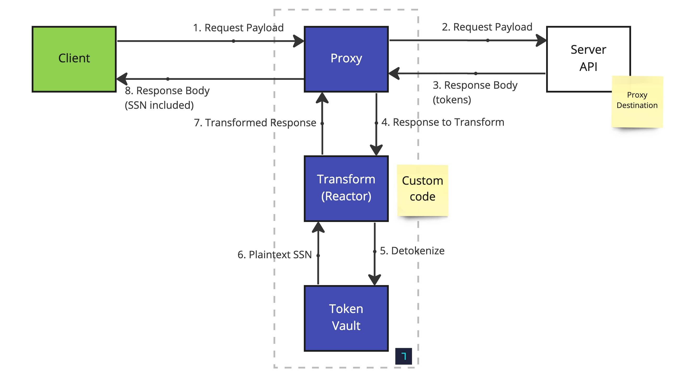

# Inbound Detokenization Example

This repository shows how to accept incoming https requests from any client, forwarding them to a server; and detokenize the token references (id) from the response, passing raw token data to the requester (client).

In this setup, the client wants to query the server for a user's SSN. The server has that data tokenized, so we will transform the server response to detokenize the ssn. To represent the server URL, we will use `https://echo.basistheory.com/anything`, to echo back whatever was passed in the request.



## Provision Resource with Terraform

[Create a new Management Application](https://portal.basistheory.com/applications/create?name=Terraform&permissions=application%3Acreate&permissions=application%3Aread&permissions=application%3Aupdate&permissions=application%3Adelete&permissions=proxy%3Acreate&permissions=proxy%3Aread&permissions=proxy%3Aupdate&permissions=proxy%3Adelete&type=management) with full `application` and `proxy` permissions.

Paste the API key to a new `terraform.tfvars` file at this repository root:

```terraform
management_api_key = "key_W8wA8CmcbwXxJsomxeWHVy"
```

Initialize Terraform:

```shell
terraform init
```

And run Terraform to provision all the required resources:

```shell
terraform apply
```

## Invoke the Proxy

Use the `inbound_proxy_key` generated as a Terraform state output to make the following request.

```shell
curl --location --request POST 'https://api.basistheory.com/proxy?bt-proxy-key={{inbound_proxy_key}}' \
--header 'Content-Type: application/json' \
--data-raw '{
"ssn": "ea0625f8-7354-4aba-9c34-0aa596353355"
}'
```

The `ssn` value in the request should be replaced by a token previously created.
